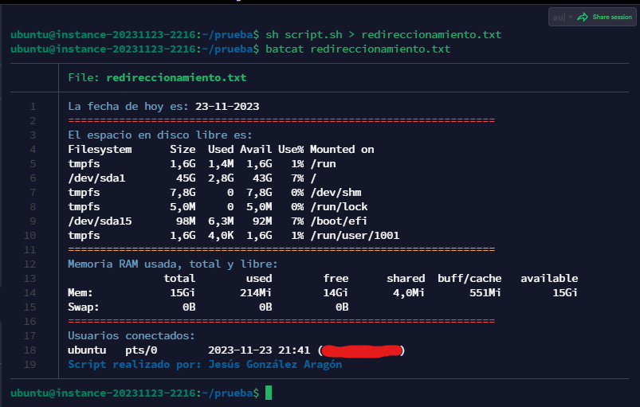

# Redireccionamiento

Enunciado:
Genera un archivo llamado informe.txt que contenga:
* La fecha del sistema formateada (dia, mes y año).
* El espacio en disco (df -h).
* Memoria libre del sistema (free -h).
* Usuarios conectados.

```bash
date
clear
```
> Hay que subir imagen de que el script ha sido ejecutado con éxito.

